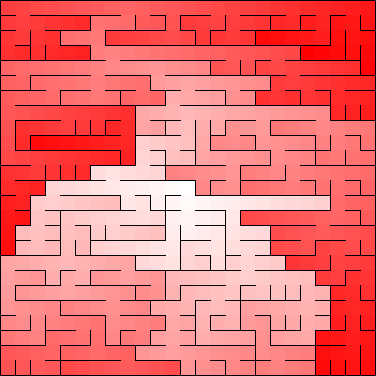
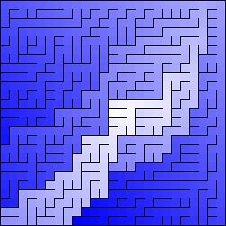
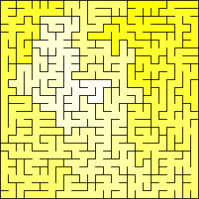
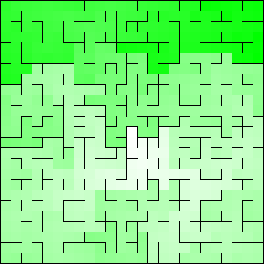
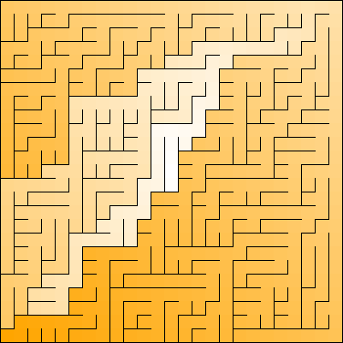
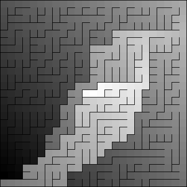

# Mazes

## Maze Example

## Binary Tree Maze

## Sidewinder Maze

## Solved Dijkstra Binary Tree Maze

## Another Solved Dijkstra Binary Tree Maze

## Longest Path Dijkstra Maze

## Colored Maze Examples

## Aldous-Broder Maze

