# Mazes--Need I say more?

## Maze Example
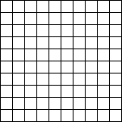
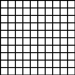
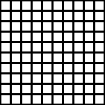

## Binary Tree Maze
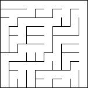

## Sidewinder Maze
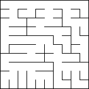

## Solved Dijkstra Binary Tree Maze
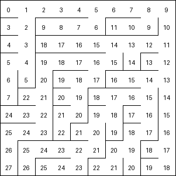

## Longest Path Dijkstra Maze
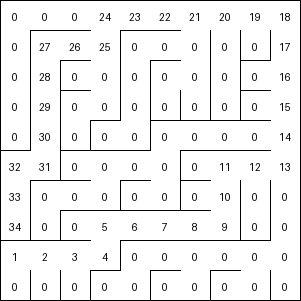

## Aldous-Broder Maze
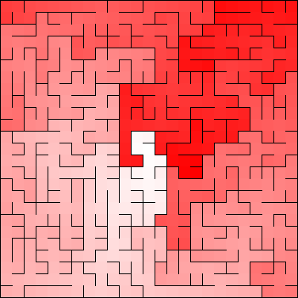

## Wilson's Maze
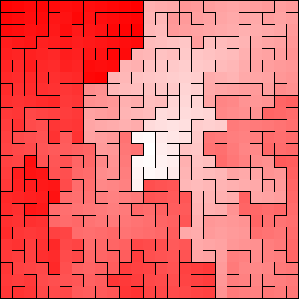

## Hunt and Kill Maze

## Colored Mazes
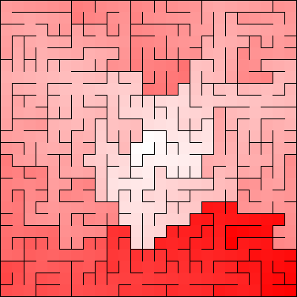
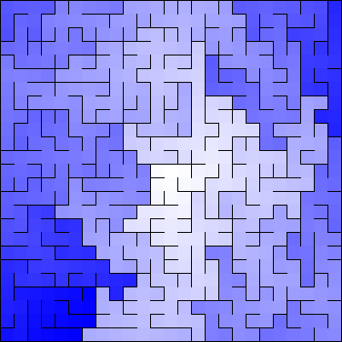
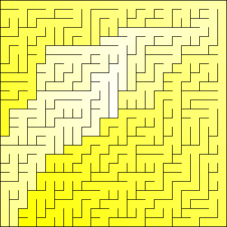
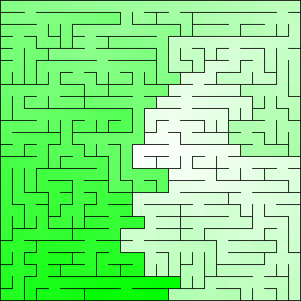
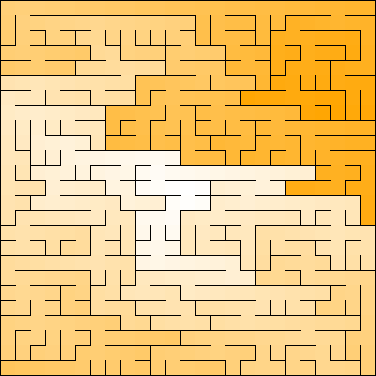
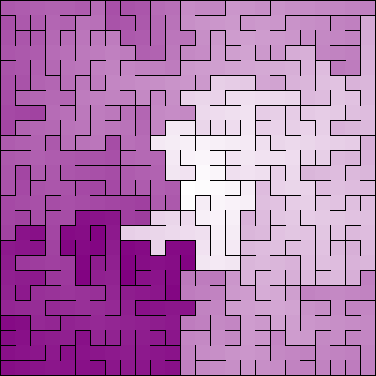
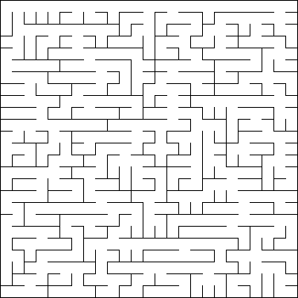

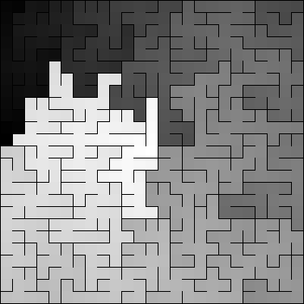

## Video Formats

