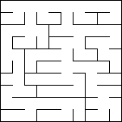
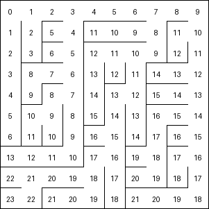
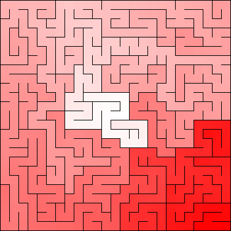
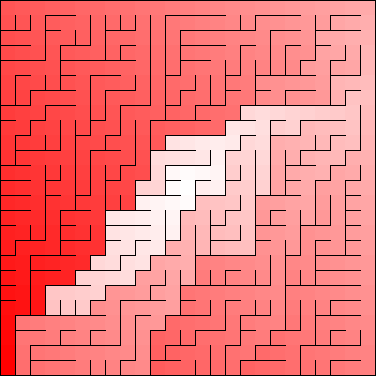
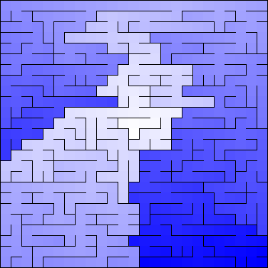
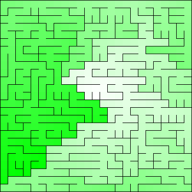
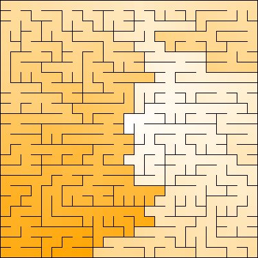
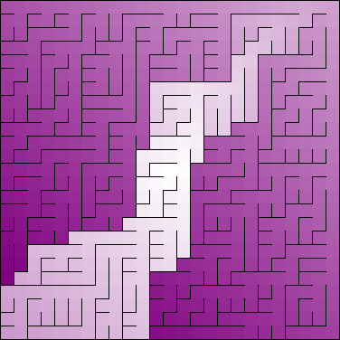

# Mazes--Need I say more?

## Maze Example

## Binary Tree Maze

## Sidewinder Maze

## Solved Dijkstra Binary Tree Maze

## Longest Path Dijkstra Maze

## Aldous-Broder Maze

## Wilson's Maze

## Hunt and Kill Maze

## Colored Mazes

## Video Formats

